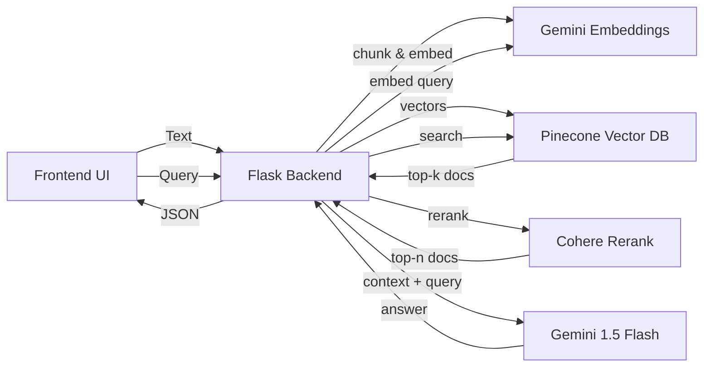

# MiniRAG - Track B Submission

## Overview
MiniRAG is a lightweight, hosted RAG (Retrieval-Augmented Generation) application built with Flask, Pinecone, Google Gemini, and Cohere. It allows users to upload text documents, indexes them into a vector database, and perform semantic search with reranking to get grounded answers.

## Architecture



## Setup & Quick Start

### 1. Clone & Install
```bash
git clone <repo_url>
cd miniRag
pip install -r requirements.txt
```

### 2. Environment Variables
Create a `.env` file based on `.env.example`:
```ini
GOOGLE_API_KEY=your_gemini_key
PINECONE_API_KEY=your_pinecone_key
COHERE_API_KEY=your_cohere_key
```

### 3. Run the App
```bash
python app.py
```
Visit `http://localhost:5000` in your browser.

## Configuration & Specs

### Chunking Strategy
- **Size:** 1000 tokens (approx) to capture full contexts.
- **Overlap:** 150 tokens to ensure continuity at boundaries.
- **Method:** `tiktoken` (cl100k_base) aware splitting. 

### Retrieval Pipeline
1. **Search:** Cosine similarity via Pinecone (Top-10 results).
2. **Rerank:** `Cohere Rerank v3.0` (Top-3 results) to optimize relevance.
3. **Generation:** `Gemini 1.5 Flash` with a strict system prompt for grounding.

## Evaluation
A minimal evaluation script `eval.py` is included.
- **Gold Set:** 5 Q/A pairs based on Apollo 11 text.
- **Run:** `python eval.py`
- **Metric:** Keyword recall in generated answers.

## Remarks & Trade-offs
- **Chunk Size:** Chosen large (1000) because Gemini has a large context window and it reduces segmentation issues, though it might lose granularity for very focused facts.
- **Latency:** Reranking adds ~200-500ms but significantly improves precision.
- **Limits:** Uses Free Tier of all services. Pinecone Serverless might have cold starts.
